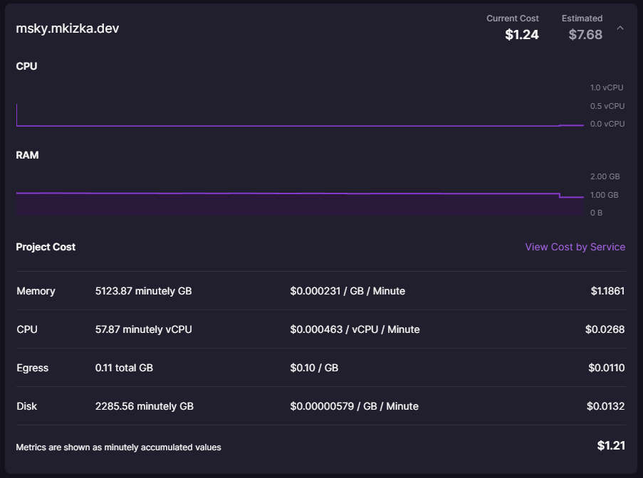
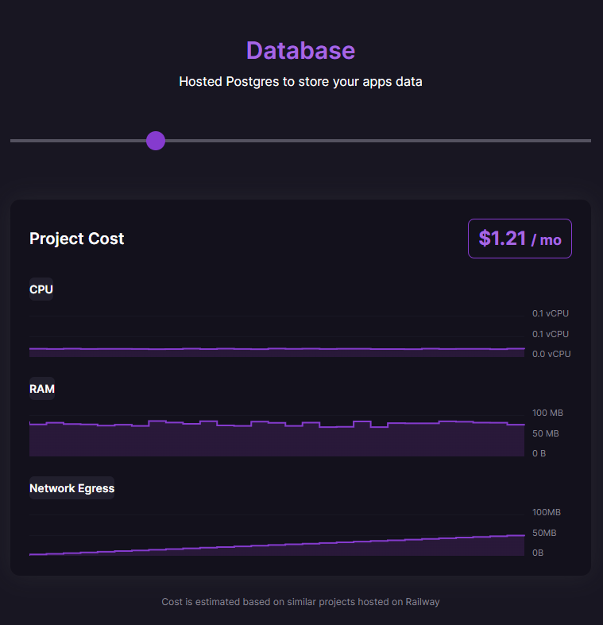

多分これが一番簡単だと思います。

<!-- more -->

[:contents]

## Misskeyサーバーの作り方

**注意！Hobbyプラン以上の契約をした[Railway](https://railway.app?referralCode=mveF9L)のアカウントが必要です。**

1. 「Deploy on Railway」↑をクリックします。ただのリンクです。  
2. 「Deploy Now」をクリックします。
3. 「Deploy」をクリックします。
4. 数分待ちます。終わり。

## もう少し詳しく
こちらにまとめています。

[https://github.com/mkizka/misskey-railway-template/blob/main/README_ja.md:embed]

### Mastodon版もあるよ

[https://github.com/mkizka/mastodon-railway-template/blob/main/README_ja.md:embed]

## サーバー代
まだ1ヵ月間使用していないのであくまで推定ですが、少なくとも月10ドル以上はかかるようです。

実際にMisskeyサーバーを立ち上げて数日放置してみました。

このサーバーでは初期設定のみして一人もフォローしていない状態です。月額の支払い日まで3週間ほどある状態で始めてから数日経って「推定：7.68ドル」となっているので、1ヵ月10ドルほどと思われます。

ただし料金は使用したCPUやメモリの量に応じて変動するので、フォローを増やすほど(厳密にはフォローした人が投稿するほど)料金はかかります。

VPSを使えばもっと安く出来るかもしれませんが、Linuxサーバーに詳しくない人やサーバー管理の面倒さを抑えたい人にはおすすめです。

## Railwayの良いところ
もう書くことが無くなったので、この仕組みを実現しているRailwayについて書きます。

### 5ドルから始められる
Railwayは少し前に料金体系が改訂されて、無料プランがかなり絞られた変わりにHobbyプランが良い感じになりました。

Hobbyプランはなんと5ドル/月です。他のPaaSだと無料プランは何かと制限がきつく、有料プランは最低20ドル/月から、みたいなのが多い印象の中、これは良いと思いました(自分が知らないだけでもっと安いところはあるかも)。

[https://railway.app/pricing:embed]

ただこの5ドル/月プラン、よく見ると「+RESOURCE USAGE」とあるように、5ドル分の使用料を超過するとその分の請求が上乗せで来ます。例えば3ドル分使えば5ドル請求されて、6ドル分使えば6ドル請求されるイメージです。

要はただの従量課金ですが、もちろん金額に応じてアラートを出したりプログラムを止める機能もあります。

[https://docs.railway.app/reference/usage-limits:embed]

このように超過分は従量課金になってしまいではありますが、逆に言えば小さめのプログラム(DiscordのBotなど)であれば毎月5ドルでプログラムが動かせます。

#### もっと安くなる場合もある
特定の条件を満たすと5ドル分の利用料を免除されることがあるようです。自分はこれに該当していました。通りで安いと思った。

> Railway waives the monthly Hobby plan subscription fee for a small set of active builders on the platform. Eligibility is automatically assessed based on several factors, including your usage on the platform, your GitHub account, and more. If you qualify, you will be notified in the Dashboard or when you upgrade to the Hobby plan.
> 
> https://docs.railway.app/reference/pricing

### DBが安い
DBの支払いはサーバーとまとめられ、課金方式も同じです。なんとトップページには1.21ドルでPostgreSQLが1ヵ月使えると書いてあります。本当か？？

僕は今のところ全体の使用料として月1~5ドルくらい(5ドルの免除含む)しか払っていないので、実際これくらいの値段で使えているようです。

自分が昔使っていたConoHaは500円/月、Google Cloudは1000円/月以上(うろ覚え)していたと思うので、かなり安く感じます。もちろんDBの負荷によっては変動しますが...。

### 機能がシンプルなのに必要十分
言葉で説明するのが難しいですが、機能が全体的にシンプルでとても使いやすいです。難しいと感じる設定がありません。

- 負荷のグラフ表示
- ヘルスチェック
- 基本的な設定をtoml、jsonで書ける
- 構造化したログをフィルタ、検索できる
- アプリテンプレート
- CLIからデプロイ
- GitHubからデプロイ
- PRデプロイ

あたりが気に入っています。一方で人によっては必要な複雑な設定は出来ません(例えばネットワーク周り、複数ポート開放、UI操作に相当するCLIコマンドが一部無い)が、あっても使いこなせないので僕は無いところが良いと感じます。

### 機能改善に積極的
上に書いた機能のうちいくつかは2023年のリリースされたものです。機能追加はTwitterで発信しているんですが、日に日に良くなっていっているのを感じます。

[https://twitter.com/Railway/status/1746000380381769823:embed]

### Discordサーバーが活発
DiscordサーバーでRailwayのスタッフと思われる方と利用者が交流しているのをよく見かけます。フォーラムでサポートも受けられるようです。

## おわり
終わりです。Misskeyサーバーの立て方について書こうと思っていましたが、Railwayの方がメインになってしまいました。記事を分けるべきかと思いましたが面倒なのでこのまま公開します。

本ページのRailwayのリンクには招待コードがついています。そこから始めるとサービス内クレジットが少し僕に入るので、サーバー代の足しになったら嬉しいなと思います。
